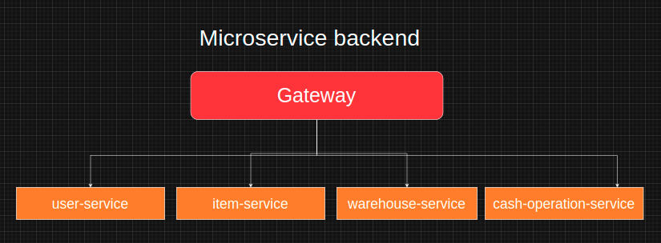

# online-store-backend

---
# Gateway

API Gateway будет центральной точкой, через которую проходят все запросы. Он должен выполнять проверку авторизации для каждого входящего запроса.

## Передача информации о пользователе в заголовках

В API Gateway после проверки токена JWT можно передавать информацию о пользователе в заголовках каждого запроса. Например:

**Описание полей:**

* `Authorization`: Заголовок, содержащий JWT-токен для аутентификации.
* `X-User-Id`: Пользовательский идентификатор.
* `X-User-Roles`: Список ролей пользователя, разделенных запятой.

**Описание таблицы `Token` в Redis:**

* `token`: Представляет собой токен. Тип данных: `STRING`.
* `user_id`: Идентификатор пользователя. Тип данных: `LONG`.
---